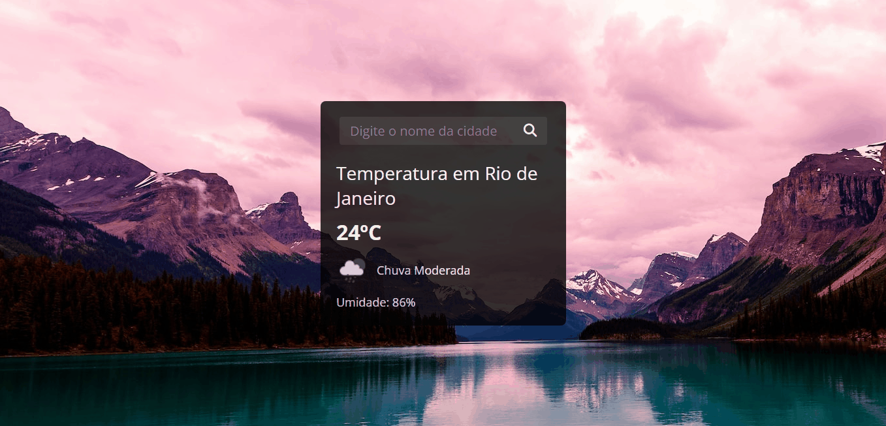
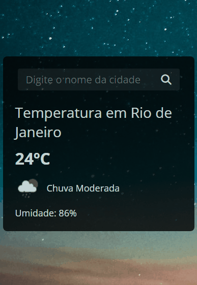

# Previsão do Tempo

Projeto desenvolvido durante a Missão Você Programador, do <a href="https://github.com/rodolfomori-devclub">Dev Club</a>, onde a proposta era a a criação de um site que nos permitisse consultar o tempo em todos os lugares do mundo. Para isso, o <a href="https://github.com/rodolfomori">Rodolfo Mori</a> nos guiou utilizando a Open Weather API para alcançarmos nosso objetivo.

## 🔧 Tecnologias
- HTML
- CSS
- JS
- Open Wheather API
- Git
- Github

## 🔗 Acesso

Para acessar o projeto, basta <a href="">clicar aqui </a>!

## 💻 Demo

| Versão Desktop  | Versão Mobile |
| -------------- |-------------- |
|  |  |